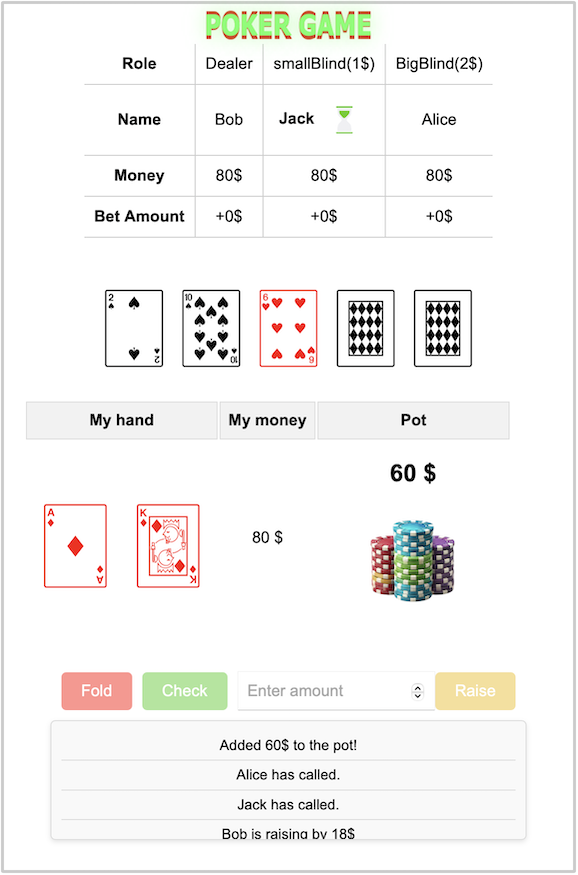

# Team 77

### Description

Our poker web app adheres to the standard rules of Texas Hold’em Poker with very slight differences (i.e no straddles).

The UI displays the following: the dealer, small blind, big blind, with the amount of the blinds; all the players’ names with their balance and total bet amount, the current player will be in bold; the action taken by the current player and the remaining hands of the game; the communal cards (aka the cards in the middle) and the pot size; the player’s personal hand and his balance; the actions that the player can take; a log with all the actions that happening.

### Playing instructions

To start a game of poker simply enter the names of the playing players (has to be at least 3 players).
Join the game by selecting your name, and send the link to the other players.

You will then have a simple UI, displaying all the information needed for a simple game of Texas Hold'em Poker. To play, when it's your turn, you can act by pressing the buttons: fold, check/call and raise (by a given entered amount). 

For detailed rules of Texas Hold'em Poker, please check out this link: 
https://www.pokernews.com/poker-rules/texas-holdem.htm 

### UI Snapshot 

### Sources

the following resources for learning and implementing CSS and HTML in this project:

#### CSS Learning Resources:
- **[MDN Web Docs (Mozilla Developer Network)](https://developer.mozilla.org/en-US/docs/Web/CSS)**: A comprehensive and authoritative reference for web developers, providing in-depth tutorials on the basics of CSS as well as advanced topics.
- **[CSS Beginnners](https://grid.malven.co/)**: A website providing exemples of css code with a picture of the result.
- **[Letecode](https://letecode.com/)**: Offers a complete CSS tutorial for beginners, covering everything from CSS fundamentals to advanced techniques. 
- **[Uiverse.io CSS Animation](https://uiverse.io/ayman-ashine/rare-otter-33)**: Implemented part of the code from this specific source for the header animation "Poker Game".

#### HTML Learning Resources:
- **[W3Schools](https://www.w3schools.com/html/)**: A beginner-friendly platform that provides tutorials and examples to learn HTML efficiently.
- **[MDN Web Docs - HTML](https://developer.mozilla.org/en-US/docs/Learn/HTML)**: A thorough guide for HTML, suitable for both beginners and advanced developers.

Additionally, utilized GPT as a learning tool to deepen my understanding of HTML and CSS. It served as a resource for clarifying concepts, exploring best practices, and debugging ideas during development. While it provided valuable educational guidance, all the coding and implementation decisions were carried out independently.

#### Image and Animation Sources:
- **pot.png**: Generated using DALL-E, an AI image generator by GPT.
- **hourglass.gif**: Sourced from [LottieFiles](https://lottiefiles.com/free-animation/hourglass-ZsufC3g4O4), a platform for high-quality animations.

